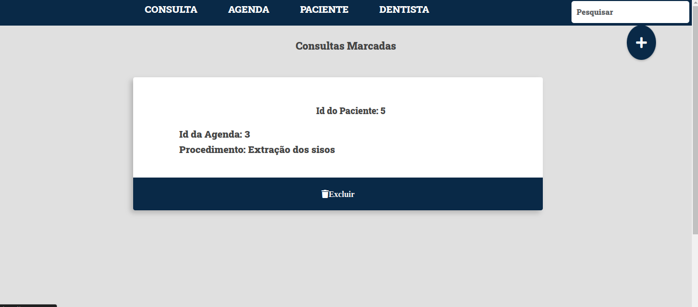
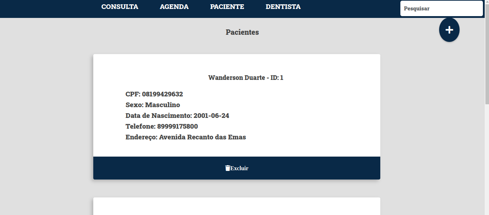
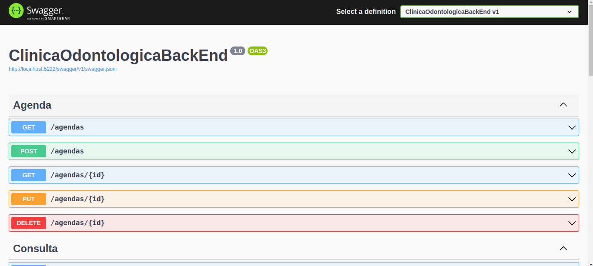
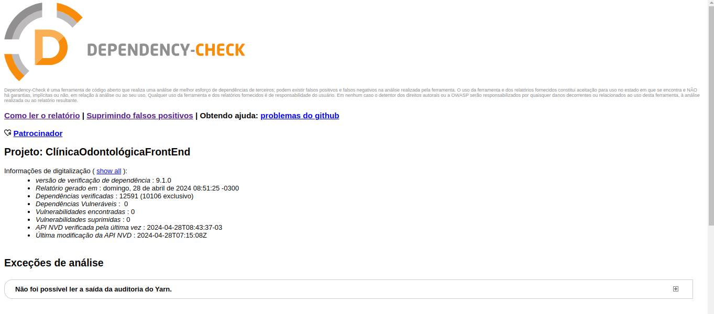
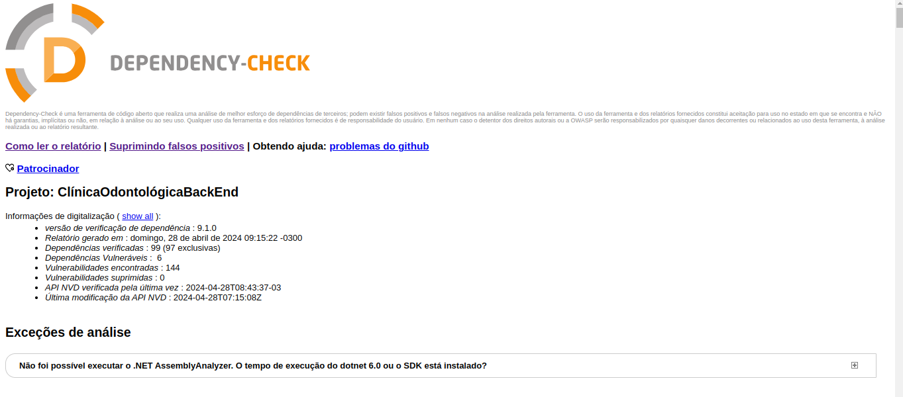
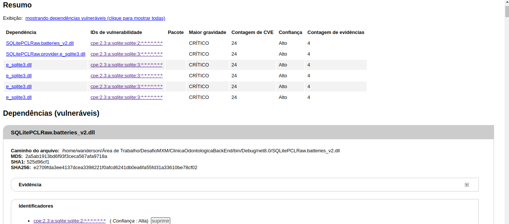

# Desafio MXM

`Desafio`: Implementar a ferramenta Dependency Check para analisar um projeto em C# e verificar sua vulnerabilidade. Pode pegar um projeto qualquer com componentes diversos, ou criar o seu próprio.

## Projeto Utilizado no Desafio

Utilizei um projeto de minha própria autoria que consiste em uma representação de um sistema para uma Clínica Odontologica

### Front-End

O sistema foi desenvolvido no **`Framework Angular`**, onde o usuário com a utilização do sistema terá um controle das Agendas e Consultas registradas previamente, além de ser possível fazer cadastro de Pacientes e Dentistas.

- **Gerenciamento de Pacientes e Dentistas:**

    Os funcionários da clínica poderão adicionar, editar e excluir informações dos pacientes e dentistas.

- **Registro de Agendas e Consultas**

    OS funcionários poderão fazer cadastro de Agendas para um Dentista específico. E poderão marcar Consultas para os Pacientes escolhendo uma Agenda pré-cadastrada que melhor atender o Paciente.

**`Framework Angular:`** Angular é um framework de desenvolvimento front-end mantido pelo Google e uma comunidade de desenvolvedores. Ele é usado para criar aplicativos web dinâmicos e responsivos. Angular utiliza a linguagem TypeScript, que é uma superconjunto de JavaScript, para desenvolver aplicações com uma arquitetura orientada a componentes.





>As imagens acima demonstra o Front-End em execução trazendo as informações de Consultas e Pacientes da API, portanto, essas informações estão vindo API e a API está salvando essas informações em um banco de Dados chamado SQLite.

**`SQLite:`** SQLite é um sistema de gerenciamento de banco de dados relacional de código aberto, leve e autônomo, amplamente utilizado em aplicativos de software. Ele é incorporado diretamente nos aplicativos, eliminando a necessidade de um servidor de banco de dados separado. SQLite é rápido, eficiente e multiplataforma, sendo uma escolha popular para aplicativos móveis, navegadores da web e outros contextos onde um banco de dados leve é necessário.

### Back-End

A parte do Back-End foi desenvolvido com o `C#`, com o intuito de criar uma `API (Interface de Programação de Aplicações)`, em que é feito uma comunicação com o Front-End para que possa ser injetado dados na API e ao mesmo tempo possa consumir esses dados da API, trazendo para o Front-End. Vale ressaltar que está API funciona as 4 operações do CRUD. E a sua documentação é feita de forma automática através da ferramenta `Swagger`.

- **`C#:`** C# é uma linguagem de programação moderna e orientada a objetos desenvolvida pela Microsoft. Com uma sintaxe limpa e familiar, suporta recursos avançados de programação, como encapsulamento, herança e polimorfismo. É amplamente utilizado para desenvolvimento de aplicativos desktop, web, móveis e jogos, com suporte multiplataforma através do .NET Framework e do .NET Core.

- **`API:`** Claro, uma API (Interface de Programação de Aplicações) é um conjunto de rotinas, protocolos e ferramentas que permite a comunicação e interação entre diferentes softwares. Basicamente, ela define como diferentes componentes de software devem se comunicar entre si. as APIs desempenham um papel fundamental na construção de sistemas distribuídos e na criação de ecossistemas de software interconectados. Elas permitem que os desenvolvedores criem aplicativos mais poderosos, ao mesmo tempo em que promovem a reutilização e a interoperabilidade.

- **`Swagger:`** Swagger é uma ferramenta muito útil para projetar, documentar e testar APIs de forma eficiente. Ele fornece uma maneira de descrever a estrutura de uma API RESTful usando um formato JSON ou YAML. é uma ferramenta valiosa para desenvolvedores e equipes de desenvolvimento que desejam criar APIs robustas, bem documentadas e fáceis de usar.



```txt
A imagens mostra a API em funcionamento com seus respectivos endpoints de Agenda contendo as funcionalidades do CRUD.
    1. GET: Endpoint para verificar as agendas cadastradas.
    2. POST: Endpoint para cadstro de uma nova Agenda.
    3. PUT: Endpoint para fazer a atualização de uma Agenda específica.
    4. DELETE: Endpoint para remover uma Agenda específica.
```

## Verificação de Vulnerabilidades

O requisito principal deste desafio é verificar as vulnerabilidades utilizando a ferramenta `Dependency Check`, contidas nas bibliotecas que foram instaladas no projeto, tanto no Front-End como no Back-End. Vale ressaltar, que esta ferramenta não faz a verificação das vulnerabilidades do projeto em si, e sim das bliotecas externas no sistema.

- **`Dependency Check:`** O Dependency Check é uma ferramenta de segurança que identifica e relata vulnerabilidades em bibliotecas de terceiros usadas em projetos de software. Ele verifica contra uma base de dados de vulnerabilidades conhecidas, integra-se a ferramentas de build e gera relatórios detalhados sobre as vulnerabilidades encontradas. Essencial para garantir a segurança do software, o Dependency Check automatiza a verificação de vulnerabilidades em cada versão do projeto.

Verificação de Vulnerabilidades no FrontEnd do Sistema:



```txt
Analisando a imagens acima é possível identificar que a ferramenta Dependency Check não identificou nenhum tipo vulnerabilidades no Front-End do sistema.
```





```txt
Já no Back-End a ferramenta identificou 6 dependências, que de fato foram instaladas 6 bibliotecas externas:
    1. AutoMapper
    2. Microsoft.AspNetCore.OpenApi
    3. Microsoft.EntityFrameworkCore
    4. Microsoft.EntityFrameworkCore.Proxies
    5. Microsoft.EntityFrameworkCore.Sqlite
    6. Microsoft.EntityFrameworkCore.Tools

No entanto, foram identificadas 144 vulnerabilidades nestas bibliotecas, isso significa que o sistema não é tão seguro, e futuramente com a utilização constante do sistema, caso ele seja implementado, pode acontecer algumas falhas, deixando as informações do banco de dados em risco. Por tanto, com o conhecimento das vulnerabilidades presentes no sistema fornecido pela ferramenta Dependency Check, o ideal a se fazer é fazer a análise detalhadamente das vulnerabilidades e consequentemente fazer a solução das mesmas.
```
